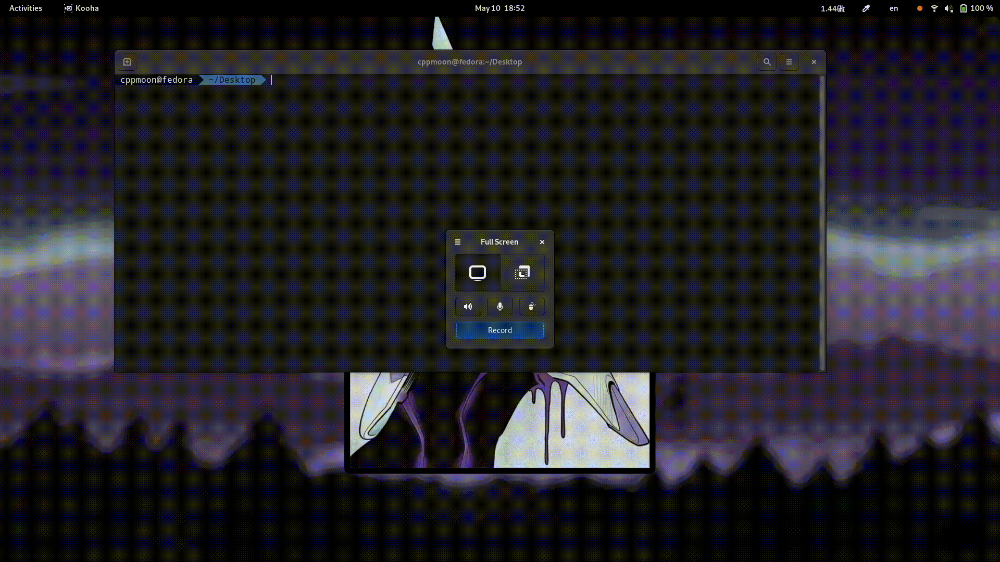

# Аэродинамика коровы
Аэродинамика коровы -- это программа, показывающая аэродинамику коровы.
## Пример использования

## Установка и запуск
Установка зависимостей:
```bash 
pip install -r requirements.txt
```
Запуск:
```bash
python3 -m cow
```
